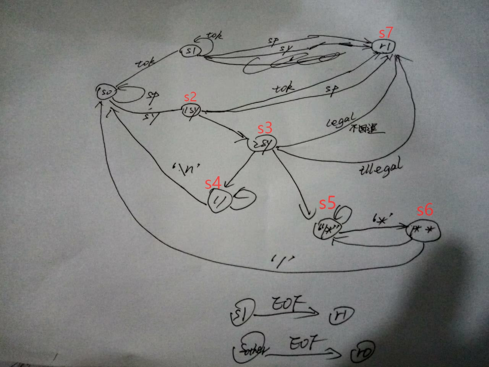

# Lab-1 Report
我们小组采取的是 “集中精力办大事” 的工作方式，预约一个研讨室然后各自写自己的，写完之后互看并且调试。中间关于分隔符以及注释的检查标准发生了变化，所以我们的阶段也分为两个。
## 分工以及流程
### 1. 分割标准改变之前
+	我负责完成从代码文件中读取一个有效字符串的函数，但是实现过程当中发现 token 之后紧接 symbol 或者注释符，以及 symbol 之后紧接注释符的情况非常复杂，而且没有明确的标准，所以组内一致认为先实现 “严格以分隔符确定有效串” 的函数。  
	
### 2. 分割标准改变之后
  
+	sy: symbol, sp: split, tok: token, 跳转箭头上的是跳转条件，即遇到该类别字符就跳转。最下面两行表示只有 s1( 后来发现 s2 也是) 遇到 EOF 才算读到了有效字符.
+	吸取了之前 “情况太多太杂，代码写得很乱” 的教训之后，这次在开始之前我们先对所有可能的输入情况进行了讨论，并画成了如上图的状态机。之后的分工中，我负责状态 s0,s4,s5,s6 的实现。

## 最后完成的工作
1.	标准变化前，“严格以 split 符分割字符串” 的 token 获取函数的实现，但没有调试就除了新标准；
2.	标准变化后(下略) ,参与状态机的绘制；
3.	状态机中 state0,4,5,6 的实现；
4.	代码最后的整合和检查. 

## 问题与解决
1.	**问题**：输入情况的繁杂；  
	**解决**：先把可能情况讨论完，总结出框架（即我们的状态机）在动手写代码；
2.	**问题**：测试中会在每行的末尾多输出一个 error 信息  
	**解决**：先通过调试找到是从哪个状态返回主函数，而出现这个问题的，然后在这个状态中增加一条 “输出该有效字符串” 的语句，最后发现输出中，该字符之后的字符串提到了行首，因此得知是 '\r' 字符。  
    &ensp;&ensp;&ensp;&ensp;&ensp;&ensp;后来去看 google group 同学问过了这个问题，主教更新了测试文件之后也就正常了；
3.	**问题**：未配对 ‘\*/’ 以及 ‘/\*’ 没有配对就遇到了文件末尾  
	**解决**：通过邮件助教，知道了前者应该保留，并输出成两个字符，后者应该忽略注释符之后的所有字。

## 收获
1.	开始写代码之前一定要把情况先讨论清楚，然后在一个框架、状态机或者伪代码下去实现真正的代码；
2.	一个好的编程环境能很大地提高效率，比如 git 还有调试工具；
3.	原来 Dev-cpp 这么难，虽然它很简陋。多发邮件是个好办法。
