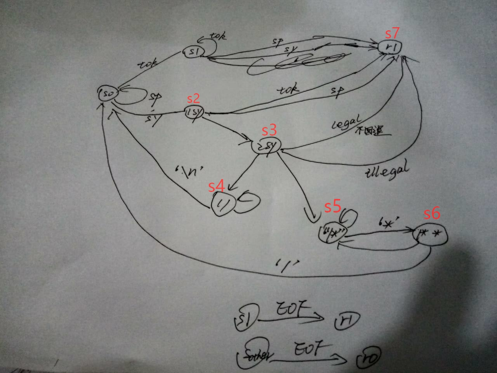
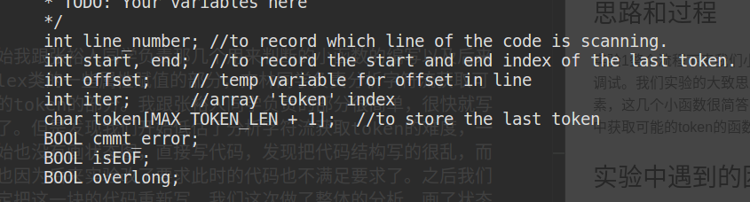

# Report of the lab-1 of Lecxical Analysis

                            江学强 PB16120100

## 思路和过程

实验1整个流程下来我们小组的三个组员始终是奋战在一起的，一起商量思路然后分配任务，最后调试。我们实验的大致思路是，写几个小函数来判断分割获取到的词素是否是否一类的词法元素，这几个小函数很简答，就是简单的判断，写起来很快也没耽误时间，另外再写一个从字符流中获取可能的token的函数。得到词法属性后调用analysis函数给lex类的一些属性赋值即可。

## 实验中遇到的困难

开始我跟张裕人同学负责那几个用来判断的小函数的编写以及后来给lex类的一些属性赋值的部分，方林同学负责分析字符流获取可能的token的部分。我跟张裕人同学负责的部分很简单，很快就写好了。但是发现我们开始低估了分析字符流获取token的难度，一开始也没有画状态图，直接写代码，发现把代码结构写的很乱，而且也因为后来实验改了要求此时的代码也不满足要求了。之后我们决定把这一块的代码重新写，我们这次做了整体的分析，一起讨论最后画了状态图，之后我们三个一起实现了这个状态机，这一过程比较顺利。

迷之状态图如上（恐怕只有我们组员才能看懂)

但是也有一些其他的问题没有解决，注释不匹配时候的报错和token的开始位置和结束位置等。为了处理这些情况我们在lex结构体中加入了一些标志变量和记录位置的变量。

line_num很好处理，只要开始赋值为1后来每次遇到'\n'时加1即可，offset变量是为了更快的得到end变量，后面的isEOF和cmmt_error、overlong变量都是为了处理一些特殊情形，token过长，注释搭配错误和到达文件结尾的一些情况，这里不再赘述是怎么解决的。

这次实验的debug过程异常顺利，虽然在程序能跑之后遇到了一些bug，但方林同学很快就把bug解决了，最后我负责最后测试和merge到master分支的的时候虽然也发现了一点点小bug，但都很快就解决了。

## 实验收获

- 对词法分析的过程更熟悉了也有了直观的感受
- 基本学会了用git来合作项目
- 跟队友关于项目的沟通和交流也让我感觉到很有收货

## 工作量总结

代码的编写我们组员三个都是始终在一起写的，因为不是同宿舍，所以都是约时间约地点一起写，因此贡献量三个人都差不多，这点从我前面实验过程好思路的描述也能看到。