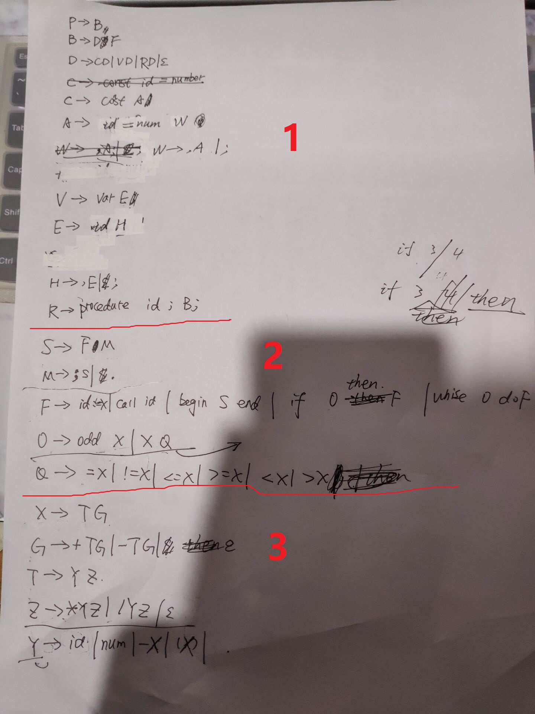

# Lab-2 Report
产生式见文末附录
## 完成的工作
1.	从语法图中提取出产生式，以及后续的修正
2.	产生式中第2部分的完成
3.	测试与第1、3部分的接口，并进行修正
4.	提供语法错误检测与恢复的方法，以及提供 “变态的、能力极差的程序员可能会写出的” 错误代码用于测试错误检测功能

## 问题与解决
1.	**问题**：如何产生语法树以及如何为语义分析做准备   
	**解决**：一种方式是直接显式构造一棵多叉树，另一种方法是用栈存储文法符号。在学习完 “语法分析” 这一章之后，我建议用栈存储文法符号的索引。如果之后需要进行语义分析，也可以通过索引知道文法符号对应的数据结构，然后进行类似 “condition.val = ...” 的操作
2.	**问题**：语法错误判断以及如何恢复（整理栈并返回至合适的位置）  
	**解决**：通过学习C语言编译器对语法错误的检测和处理，并结合实际写代码时考虑的函数（如statements函数）返回条件，我解决了这个问题。具体解决策略见 *收获.2* 部分  

## 收获
1.	递归下降与 FIRST,FOLLOW 集合的联系：  
	1.	进入一个函数的条件是读到了该文法符号的 FIRST 集合
	2.	退出一个函数的条件是读到了该文法符号的 FOLLOW 集合。
2.	语法错误检测： **出错就是指没有读到应该读到的 token**   
	1.	进入函数前没有读到该文法符号的 FIRST 集合。那么类似 " 'if' statement without 'condition' " 报错，然后往后读，直到读到该文法符号的（不是这个函数的） FOLLOW 集合，比如 condition之后的 then，再继续照常处理。
    2.	函数末尾没有遇到读到该文法符号的 FOLLOW 集合，例如语句之后缺少 " ; "或者 " . "。那么报错“expected ... at ..." ，然后往后读，直到读到某一个上层函数的 FOLLOW 集合。
    3. 	函数中读到想要的终结符token，才将栈顶出栈，并正确进入下一步。如果没有遇到，那么类似 “expected 'then' after 'condition' in 'if' statement.” 报错，然后直接认为这一整条语句出错，往后读，直到读到该文法符号的 FOLLOW 集合返回。	  
    
#### 附录：
  