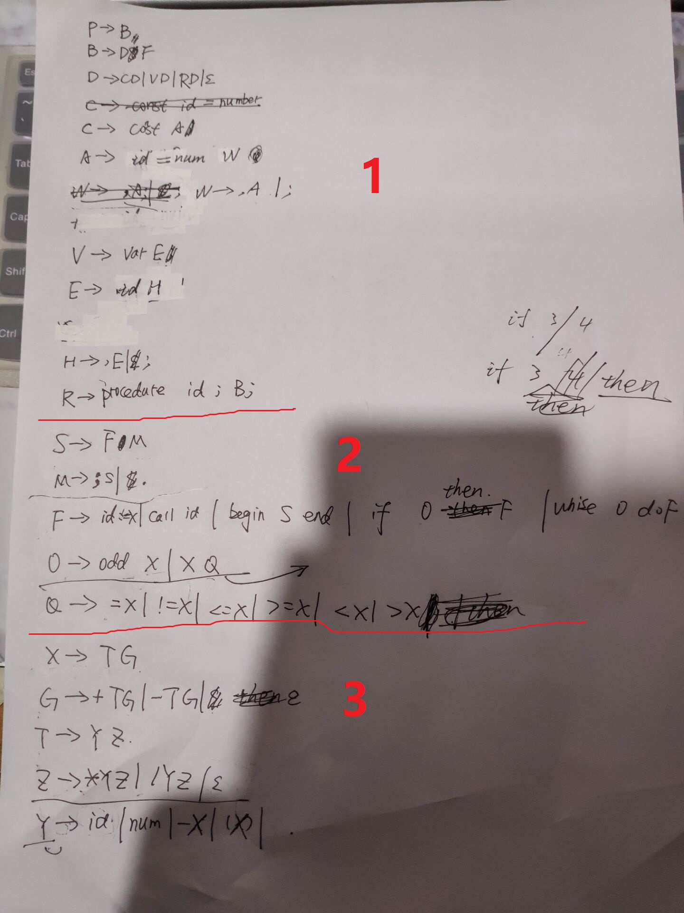
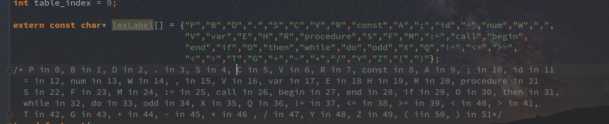
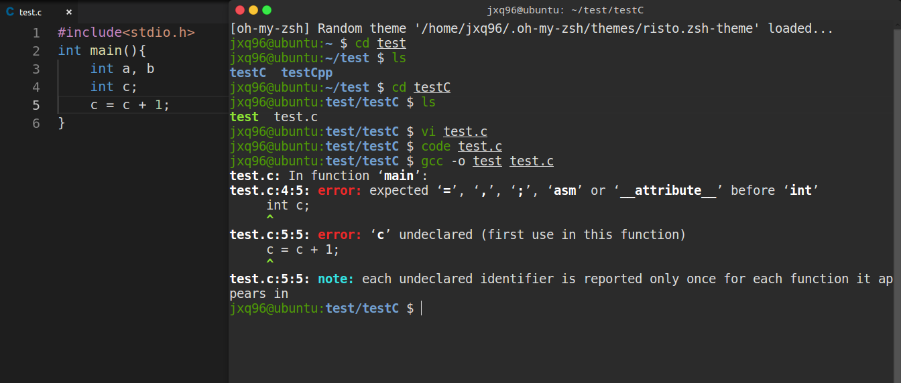

Report of Lab-2   ----- Syntax Analysis

								江学强  PB16120100

思路和过程

实验2比实验1难度大了很多，也更费时间，一开始刚看的时候无从下手，只想着照着语法图把识别语言的过程写出来，但是完全不知道怎么生成语法树，后来助教补充了一点说明后就明白了实验的一些具体事项。实验中采用打印栈的形式来表示语法树。

从语法图到产生式

这一部分主要是照着语法图写出产生式，没有多余的细节可以叙述，下面是写在纸上的产生式的照片。

栈的数据结构

我们的实验中栈中存储的式int，其中每个int表示表示的是文法符号数组中的索引。文法符号数组如下

实验中遇到的困难

实验如果只要求识别语法正确的代码就很简单，实验的难度主要体现在错误恢复和处理，我在写我负责的部分的代码(声明部分)的同时就兼顾了接收到错误信息的处理，我处理的方式很暴力，就是在需要处理某个non-termianl的文法符号时候如果遇到了非First中的输入，就一直get_token直到遇到这个文法符号的Follow集合中的元素，当然在这个读取token的同时栈也要保持相应的同步，不然后面会出很多bug。还有我们在一些错误处理的方式上借鉴了gcc的处理方式，比如:

    int a b
    int c;
    c = c + 1

这个时候gcc报的错如下：

可以看出来跟我之前的处理方式一样，也是直接跳到了分号，第二行看似正确的c的定义也被忽略了。

还有这次实验就是细节太多，一不小心容易出错，但是却并没有什么需要tricky idea的地方，只要静下性子慢慢写就问题不大。

调试过程不必详述，照着产生式把代码写好之后就是漫长的debug过程，其中调试到的错误也都是细节 错误，没有出现整个代码过程逻辑上的错误。

实验分工

我们的分工是按照产生式来分工的：

我写了8个声明相关的产生式的代码

方林同学和张裕人同学后面各6个剩余产生式的代码。

虽然声明部分的产生式多了两个，但是声明部分的代码却是最简单的，所以工作量是相当的。

最后代码的调试和整合阶段我们是一起完成的，工作量也相当。

实验收获

- 动手写代码前一定要先把实验的目的明确好
- 先把整个实验的大框架完成后面会更好处理
- 与队友协调好代码的约定很重要，否则会经常出现重复读取token或者少读取token这种bug

 
