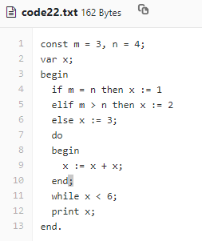
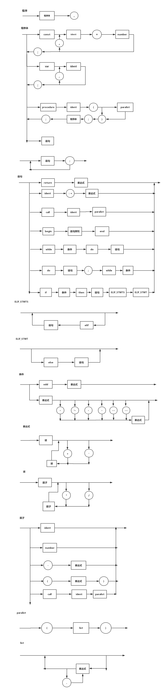

# Lab-3 Report
新的语法图见文末
## 完成的工作
1. 参与词法分析报错完善，具体完成下面两项错误处理
>#define ERR_UNRECOGNIZED_CHAR "An unrecognized character appears."  //非法字符  
>#define ERR_MISS_END_FOR_COMMENT "Missing a end for comment: has reached the EOF."&nbsp;&nbsp;&nbsp;&nbsp;&nbsp;&nbsp;//注释中的'/\*...\*/'型无结束符 

	1. 	完成合法字符判断函数 Islegal()，修改原词法分析 DFA 中的前 3 个状态的跳转条件
	2. 	修改原本注释中的'/\*...\*/'型无结束符的报错输出格式
2. 语法分析器的强化工作，具体完成了下面两项
> * 增加else/elif   ⭐⭐
> 	1. 为现有的if语句引入else与elif关键字
> 	*  词法分析需要加入对应关键字，重新设计并实现语法分析，检查时需检查语法图与运行结果
>* 增加do while  ⭐⭐
>	1. 为现有的循环语句引入do...while语法
>	*  词法分析需要加入对应关键字，重新设计并实现语法分析，检查时需检查语法图与运行结果

	1. 增加 else/elif 的工作：
		1.	修改 if 语句的整个流程和产生式
		2.	对所有 “语句、表达式、项、因子” 的 FOLLOW 集合进行更新，意味着大部分 lab-2 代码的修改
	2. do while 的工作：
		1. 语句中新增加一个分支
		2. 对所有 “语句、表达式、项、因子” 以及 “条件” 的 FOLLOW 集合进行更新，也意味着大部分 lab-2 代码的修改
3.	参与完成语法分析器最后的调试，包括 ‘语句’ 块，和部分 ‘代码块 block’ 部分

## 问题与解决
1.	**问题**：遇到非法字符，到底直接把前面当作合法字符，还是继续？即，是把非法字符当作分隔符，还是直接忽略？  
	**解决**：遇到非法字符则当作分隔符处理。在刚进入 get_token() 函数，即在词法分析 DFA 的 state0 中，offset 增加并忽略；其他情况返回已有的 token。
2.	**问题**：如下图，新增加的两条语句—— `‘ do 语句 while ’ 和 ‘ if condition then 语句 (elif condition then 语句)* else 语句 ; ’` ，会造成 `‘语句’` 可以以 `‘;’ & ‘.’` 为结尾（FOLLOW集合），也可以没有 `‘;’ & ‘.’` 结尾  
	    
	**解决**：do-while 语句实现成 `‘ do 语句 ; while ’`，这样所有 `‘语句、条件、表达式、项、因子’` 的 FOLLOW 集合都需要加入 `‘while, elif, else’`。具体产生式如下：  
    ```
        F -> if O then F ES EF  
        ES-> elif condition then F ES |  ε  
        EF -> else F | ε  
        F -> do F ; while O
    ```


 ## 附件：语法图  
 