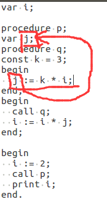

# Lab-4 Report
在开始实验报告之前，我真的吐槽一下这次实验环境的符号表实现太简陋了。。。没办法让函数 id 既存储起始代码地址，又来存储个局部符号表地址，而用 level 来查找变量，有很多局限性。。。
（还有 do stmt ; while condition 变成了 do stmt while condition，吐血.gif，虽然不难改）
## 完成的工作
1. 语法分析的扩展：print 语句的分析
2. 语句翻译工作：翻译了如下几条语句。
	1. id := X
	2. call id
	3. print X
	4. if condition then stmt elif-stmts  else-stmt
	5. while condition do stmt
3. 现场保护以及恢复具体站操作的实现
4. 漏洞修复工作
	1. 允许无参数的函数定义 & 调用，并因此，更改 call-id 的 FOLLOW 集合产生的修改
	2. do stmt ; while condition 改成 do stmt while condition
	3. 因为函数嵌套定义、嵌套调用、递归调用而产生的复杂的现场保护和恢复情况
5. 具体调试工作：检验了汇编器对样例 11、12、13、14、15、20、22的正确性，以及修正了样例 27 中嵌套调用漏洞。

## 问题与解决
重点就现场保护和恢复、if分支跳转实现
1.	**问题**：if分支跳转实现  
	**解决**：我们组把所有代码暂存在数组，最后再统一输出。用 offset 表示当前存了多少条代码，即代码的行号。
    1. 在每次 condition 语法分析之后暂存一条 JMP 指令，记录 offset 暂存到 toffset，等到遇到 elif 或者 else 或者分号再把当前 offset 存入 JMP 指令的操作数里。
    2. 在每次 statement 语句分析结束之后，暂存一条 JMP 指令，并把当前 offset 存入一个数组。数组表示所有需要直接跳转到 if 语句结尾的代码的 offset。然后到 if 语句结尾再把该数组里面存储的行号，相应的代码的操作数，设置为当前 offset。
2.	**问题**：因为 PL0 语法的特殊性，函数可以随意调用 level 小于自己的函数的局部变量，所以导致一个怪现象——递归调用需要保存现场，而嵌套调用不需要！
	

    
    
    
	**解决**：每次遇到 call id 函数调用时，先通过 level 判断调用的函数是否是当前的函数，即是否为递归调用。  
    如果递归调用，则把符号表 token_table 中所有当前 level 的局部变量存入到栈中，来保护现场，并且在函数返回之后恢复现场。  
    如果不是递归调用，则不用